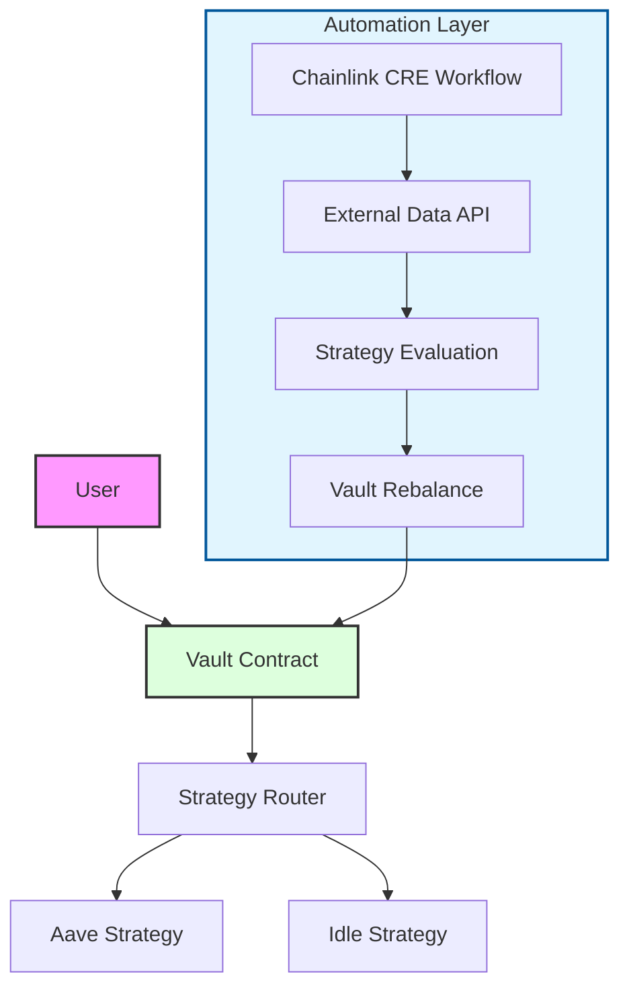
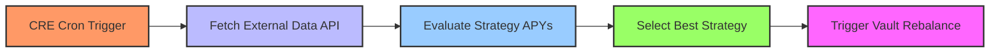

# CREFi — Autonomous DeFi Vault using Chainlink CRE

CREFi is an autonomous DeFi vault powered by Chainlink CRE (Chainlink Runtime Environment).

It automatically evaluates yield strategies and decides when to rebalance funds between DeFi protocols.

This project demonstrates how Chainlink CRE can orchestrate intelligent off-chain automation that interacts with on-chain DeFi systems.

---

# Problem

Managing DeFi strategies manually is inefficient.

Users constantly need to:

• monitor yield opportunities  
• compare APYs across protocols  
• withdraw and redeploy capital  

This leads to missed opportunities and inefficient capital allocation.

---

# Solution

CREFi automates yield strategy management using a Chainlink CRE workflow.

The workflow continuously evaluates market conditions and triggers automated vault actions when better strategies are available.

This creates a **self-optimizing DeFi vault**.

---

# Architecture



---

# System Components

## Smart Contracts

The smart contract layer defines the on-chain vault system.

```
contracts/
│
├── Vault.sol → manages user deposits  
├── Router.sol → selects strategy  
└── Strategy.sol → executes yield strategies  
```

These contracts interact with the CRE workflow to perform automated rebalancing.

---

## Chainlink CRE Workflow

The automation layer is implemented using a Chainlink CRE workflow.

Location:

```
my-workflow/main.ts
```

The workflow performs:

1. Periodic execution via cron trigger  
2. Fetch external market data  
3. Evaluate strategy conditions  
4. Select the optimal yield strategy  
5. Trigger vault rebalance

---

# Workflow Execution



---

# Chainlink Integration

This project demonstrates the use of **Chainlink CRE** as an off-chain automation layer.

CRE provides:

• workflow execution  
• external API integration  
• automated decision logic  
• secure secret management  

Chainlink components used in this project:

```
Chainlink CRE Workflow  
my-workflow/main.ts

Workflow Configuration  
my-workflow/workflow.yaml
```

---

# Example Simulation Output

Running a CRE workflow simulation:

```bash
cre workflow simulate my-workflow
```

Example output:

```
🚀 CRE Autopilot started
Vault Assets: 1000000

Aave APY: 9.02
Idle APY: 3

Chosen Strategy: Aave

📈 Rebalance Triggered
```

This demonstrates autonomous strategy selection.

---

# Project Structure

```
crefi/
│
├── contracts/
│   ├── Vault.sol
│   ├── Router.sol
│   └── Strategy.sol
│
├── my-workflow/
│   ├── main.ts
│   └── workflow.yaml
│
└── README.md
```

---

# How To Run

Install dependencies.

```bash
npm install
```

Navigate to workflow folder:

```bash
cd my-workflow
```

Run workflow simulation:

```bash
cre workflow simulate my-workflow
```

---

# Demo

Demo Video:

(Add your YouTube video link here)

---

# Future Improvements

Potential improvements:

• integrate real DeFi APY APIs  
• support additional DeFi protocols  
• cross-chain vault allocation  
• AI-based strategy optimization  

---

# Built With

• Chainlink CRE  
• Solidity  
• TypeScript  
• DeFi Strategy Logic  

---

# Hackathon Submission

Built for the **Chainlink Convergence Hackathon**.